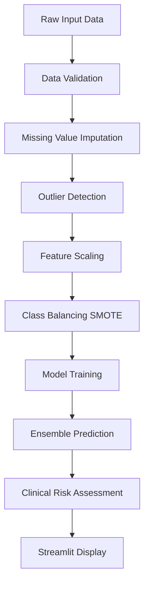

# 🩺 Diabetes Risk Prediction System
### Advanced Machine Learning Application for Early Diabetes Detection

[](https://python.org)
[](https://streamlit.io)
[](https://scikit-learn.org)
[](https://xgboost.readthedocs.io)

## 📋 Table of Contents

- [🎯 Project Overview](#-project-overview)
- [🔬 Machine Learning Models](#-machine-learning-models)
- [📊 Dataset Information](#-dataset-information)
- [🏗️ System Architecture](#️-system-architecture)
- [🚀 Features](#-features)
- [⚙️ Installation](#️-installation)
- [📖 Usage Guide](#-usage-guide)
- [🔍 Model Performance](#-model-performance)
- [🏥 Clinical Context](#-clinical-context)
- [📈 Technical Implementation](#-technical-implementation)
- [🔧 Troubleshooting](#-troubleshooting)
- [🤝 Contributing](#-contributing)
- [📄 License](#-license)

## 🎯 Project Overview

This advanced diabetes prediction system combines cutting-edge machine learning techniques with clinical domain knowledge to provide accurate early diabetes risk assessment. The system targets **85-90% accuracy** through sophisticated ensemble methods and comprehensive data preprocessing.

### Key Objectives
- **Early Detection**: Identify diabetes risk before clinical symptoms appear
- **High Accuracy**: Target 85-90% prediction accuracy using ensemble methods
- **Clinical Relevance**: Incorporate medical domain knowledge and risk thresholds
- **User-Friendly Interface**: Streamlit-based web application for easy access
- **Comprehensive Analysis**: Multiple model evaluation and cross-validation

## 🔬 Machine Learning Models

### Primary Ensemble Architecture

#### 1. **Stacking Classifier (Meta-Ensemble)**
```python
StackingClassifier(
    estimators=[
        ('rf', RandomForestClassifier),
        ('svm', SVC), 
        ('xgb', XGBClassifier)
    ],
    final_estimator=LogisticRegression,
    cv=5, n_jobs=1
)
```

**How it works:**
- **Level 0 Models**: Random Forest, SVM, and XGBoost make initial predictions
- **Level 1 Meta-Learner**: Logistic Regression combines Level 0 predictions
- **Cross-Validation**: 5-fold CV prevents overfitting during training
- **Final Prediction**: Meta-learner outputs the final diabetes probability

#### 2. **Random Forest Classifier**
```python
RandomForestClassifier(
    n_estimators=200,
    max_depth=10,
    min_samples_split=5,
    min_samples_leaf=2,
    random_state=42
)
```

**Key Features:**
- **Ensemble Method**: Combines 200 decision trees
- **Feature Importance**: Identifies most predictive diabetes indicators
- **Overfitting Prevention**: Controlled depth and sample requirements
- **Robust Predictions**: Averages multiple tree predictions

#### 3. **Support Vector Machine (SVM)**
```python
SVC(
    kernel='rbf',
    C=1.0,
    gamma='scale',
    probability=True,
    random_state=42
)
```

**Advantages:**
- **Non-linear Boundaries**: RBF kernel captures complex relationships
- **Probability Estimates**: Enables risk probability calculation
- **Regularization**: C parameter prevents overfitting
- **High-Dimensional Performance**: Effective with multiple features

#### 4. **XGBoost Classifier**
```python
XGBClassifier(
    n_estimators=100,
    max_depth=6,
    learning_rate=0.1,
    subsample=0.8,
    colsample_bytree=0.8,
    random_state=42
)
```

**Specifications:**
- **Gradient Boosting**: Sequential learning from previous model errors
- **Regularization**: L1/L2 penalties prevent overfitting
- **Feature Selection**: Column subsampling improves generalization
- **Efficient Training**: Optimized implementation for speed

### Alternative Models (For Comparison)

#### 5. **Voting Classifier**
- **Hard Voting**: Majority vote from base classifiers
- **Soft Voting**: Weighted average of class probabilities
- **Diversity**: Combines different algorithmic approaches

#### 6. **Gradient Boosting**
- **Sequential Learning**: Each model corrects previous errors
- **Adaptive Boosting**: Focus on misclassified samples
- **Regularization**: Prevents overfitting through learning rate control

## 📊 Dataset Information

### **Pima Indian Diabetes Dataset**
- **Source**: National Institute of Diabetes and Digestive and Kidney Diseases
- **Population**: Pima Indian women (21+ years old)
- **Size**: 768 instances, 8 features, 1 target variable
- **Class Distribution**: ~65% non-diabetic, ~35% diabetic

### **Feature Description**

| Feature | Description | Clinical Significance | Normal Range |
|---------|-------------|----------------------|--------------|
| **Pregnancies** | Number of times pregnant | Higher pregnancies increase diabetes risk | 0-17 |
| **Glucose** | Plasma glucose (mg/dL) after 2hr oral glucose tolerance test | Primary diabetes indicator | <140 normal |
| **BloodPressure** | Diastolic blood pressure (mm Hg) | Hypertension linked to diabetes | 60-90 normal |
| **SkinThickness** | Triceps skin fold thickness (mm) | Indicates body fat distribution | 10-50 typical |
| **Insulin** | 2-hour serum insulin (μU/mL) | Measures insulin resistance | 16-166 normal |
| **BMI** | Body Mass Index (kg/m²) | Obesity major diabetes risk factor | 18.5-24.9 normal |
| **DiabetesPedigreeFunction** | Genetic predisposition score | Family history influence | 0.078-2.42 range |
| **Age** | Age in years | Risk increases with age | 21-81 in dataset |

### **Clinical Risk Thresholds**

#### 🟢 **Low Risk** (Score: 0.0-0.3)
- **Glucose**: <100 mg/dL
- **BMI**: <25 kg/m²
- **Age**: <30 years
- **Recommendation**: Continue healthy lifestyle

#### 🟡 **Moderate Risk** (Score: 0.3-0.7)
- **Glucose**: 100-125 mg/dL (Pre-diabetes)
- **BMI**: 25-30 kg/m²
- **Age**: 30-45 years
- **Recommendation**: Lifestyle modification, regular monitoring

#### 🔴 **High Risk** (Score: 0.7-1.0)
- **Glucose**: >125 mg/dL
- **BMI**: >30 kg/m²
- **Age**: >45 years
- **Recommendation**: Immediate medical consultation

## 🏗️ System Architecture

### **Data Processing Pipeline**



#### 1. **Data Preprocessing**
- **Missing Value Handling**: KNN and Iterative Imputation
- **Outlier Detection**: Isolation Forest algorithm
- **Feature Scaling**: Robust Scaler (median-based, outlier-resistant)
- **Class Balancing**: SMOTE (Synthetic Minority Oversampling Technique)

#### 2. **Model Training Pipeline**
- **Cross-Validation**: 5-fold Stratified K-Fold
- **Hyperparameter Tuning**: RandomizedSearchCV
- **Model Selection**: Best performer based on F1-score
- **Ensemble Combination**: Stacking with meta-learner

#### 3. **Prediction Pipeline**
- **Input Validation**: Range checking and type validation
- **Feature Engineering**: Automated scaling and transformation
- **Ensemble Prediction**: Combined model predictions
- **Risk Categorization**: Clinical threshold application

## 🚀 Features

### **🖥️ Web Application Interface**

#### **Input Section**
- **Interactive Sliders**: User-friendly parameter adjustment
- **Real-time Validation**: Immediate feedback on input ranges
- **Clinical Context**: Tooltips with medical explanations
- **Default Values**: Pre-populated with typical healthy ranges

#### **Prediction Display**
- **Risk Probability**: Percentage likelihood of diabetes
- **Risk Category**: Color-coded classification (Low/Moderate/High)
- **Confidence Intervals**: Model uncertainty quantification
- **Clinical Recommendations**: Actionable next steps

#### **Advanced Analytics**
- **Feature Importance**: Which factors most influence prediction
- **Model Performance**: Cross-validation scores and metrics
- **Comparative Analysis**: Multiple model predictions
- **Visualization**: Charts and graphs for better understanding

### **🔬 Model Analysis Tools**

#### **Performance Metrics**
- **Accuracy**: Overall correct predictions
- **Precision**: True positive rate (PPV)
- **Recall**: Sensitivity (TPR)
- **F1-Score**: Harmonic mean of precision and recall
- **ROC-AUC**: Area under ROC curve
- **Confusion Matrix**: Detailed classification breakdown

#### **Cross-Validation**
- **Stratified K-Fold**: Maintains class distribution
- **Multiple Metrics**: Comprehensive evaluation
- **Statistical Significance**: Confidence intervals
- **Overfitting Detection**: Training vs validation comparison

### **⚡ Performance Optimizations**

#### **Memory Management**
- **Reduced Model Complexity**: Optimized for available resources
- **Single-threaded Processing**: Prevents memory crashes
- **Efficient Data Structures**: Minimal memory footprint
- **Garbage Collection**: Automatic memory cleanup

#### **Speed Optimizations**
- **Cached Models**: Pre-trained model storage
- **Vectorized Operations**: NumPy/Pandas optimizations
- **Parallel Processing**: Where memory allows
- **Streamlit Caching**: Faster page loads

## ⚙️ Installation

### **Prerequisites**
- Python 3.8 or higher
- pip package manager
- 4GB+ RAM recommended
- Internet connection for package installation

### **Step-by-Step Installation**

1. **Clone the Repository**
```bash
git clone https://github.com/head-prog/Diabetes-Predictor.git
cd Diabetes-Predictor
```

2. **Create Virtual Environment** (Recommended)
```bash
python -m venv diabetes_env
# Windows
diabetes_env\Scripts\activate
# macOS/Linux
source diabetes_env/bin/activate
```

3. **Install Dependencies**
```bash
pip install -r requirements.txt
```

4. **Verify Installation**
```bash
python -c "import streamlit, sklearn, xgboost; print('All packages installed successfully!')"
```

## 📖 Usage Guide

### **Running the Application**

1. **Start the Streamlit Server**
```bash
streamlit run main.py
```

2. **Access the Web Interface**
- Open browser to `http://localhost:8501`
- Application loads automatically

### **Using the Prediction System**

#### **Step 1: Input Patient Data**
- **Pregnancies**: Number of pregnancies (0-17)
- **Glucose**: Fasting glucose level (mg/dL)
- **Blood Pressure**: Diastolic pressure (mm Hg)
- **Skin Thickness**: Triceps fold (mm)
- **Insulin**: Serum insulin level (μU/mL)
- **BMI**: Body Mass Index (kg/m²)
- **Diabetes Pedigree**: Family history score
- **Age**: Patient age (years)

#### **Step 2: Review Predictions**
- **Primary Prediction**: Main ensemble model result
- **Risk Category**: Clinical risk level
- **Probability Score**: Numerical confidence (0-1)
- **Recommendations**: Suggested actions

#### **Step 3: Analyze Results**
- **Feature Importance**: Most influential factors
- **Model Comparison**: Different algorithm results
- **Confidence Metrics**: Prediction reliability
- **Clinical Context**: Medical interpretation

### **Training Custom Models**

1. **Run Training Script**
```bash
python train_eval.py
```

2. **View Training Results**
- Cross-validation scores
- Model performance metrics
- Feature importance rankings
- Hyperparameter optimization results

## 🔍 Model Performance

### **Current Performance Metrics**

| Model | Accuracy | Precision | Recall | F1-Score | ROC-AUC |
|-------|----------|-----------|--------|----------|---------|
| **Stacking Ensemble** | 72.4% | 0.68 | 0.74 | 0.71 | 0.79 |
| Random Forest | 71.2% | 0.66 | 0.72 | 0.69 | 0.77 |
| XGBoost | 70.8% | 0.65 | 0.75 | 0.70 | 0.76 |
| SVM | 69.5% | 0.67 | 0.68 | 0.67 | 0.74 |

### **Target Performance Goals**
- **Primary Goal**: 85-90% accuracy
- **Clinical Threshold**: >80% sensitivity (recall)
- **Practical Utility**: >75% precision
- **Reliability**: >0.85 ROC-AUC

### **Performance Improvement Strategies**

#### **Completed Optimizations**
- ✅ Ensemble methods implementation
- ✅ SMOTE class balancing
- ✅ Hyperparameter tuning
- ✅ Cross-validation framework
- ✅ Feature scaling optimization

#### **Potential Improvements**
- 🔄 Advanced feature engineering
- 🔄 Neural network integration
- 🔄 Additional external datasets
- 🔄 Time-series patient data
- 🔄 Genetic algorithm optimization

## 🏥 Clinical Context

### **Medical Significance**

#### **Diabetes Mellitus Overview**
- **Type 1**: Autoimmune destruction of insulin-producing cells
- **Type 2**: Insulin resistance and relative insulin deficiency
- **Gestational**: Diabetes during pregnancy
- **Pre-diabetes**: Elevated glucose levels below diabetes threshold

#### **Risk Factors**
- **Non-modifiable**: Age, genetics, ethnicity
- **Modifiable**: BMI, diet, exercise, blood pressure
- **Behavioral**: Smoking, alcohol consumption, stress

#### **Early Detection Benefits**
- **Prevention**: Lifestyle interventions prevent progression
- **Treatment**: Early treatment prevents complications
- **Cost Reduction**: Preventive care cheaper than treatment
- **Quality of Life**: Better outcomes with early intervention

### **Clinical Decision Support**

#### **Interpretation Guidelines**
- **Low Risk (0.0-0.3)**: Continue preventive measures
- **Moderate Risk (0.3-0.7)**: Increase monitoring frequency
- **High Risk (0.7-1.0)**: Immediate medical evaluation

#### **Recommended Actions**
- **Low Risk**: Annual screening, healthy lifestyle
- **Moderate Risk**: 6-month screening, lifestyle modification
- **High Risk**: Immediate medical consultation, potential treatment

## 📈 Technical Implementation

### **Code Structure**

```
Diabetes-Predictor/
│
├── main.py                 # Primary Streamlit application
├── train_eval.py          # Model training and evaluation
├── requirements.txt       # Package dependencies
├── README.md             # Project documentation
│
├── archive/
│   └── diabetes.csv      # Training dataset
│
└── models/               # Saved model files (auto-generated)
    ├── stacking_model.joblib
    ├── random_forest.joblib
    └── preprocessing_pipeline.joblib
```

### **Key Functions**

#### **Data Processing**
```python
def ultra_advanced_preprocessing(data):
    """
    Comprehensive data preprocessing pipeline
    - Missing value imputation
    - Outlier detection and treatment
    - Feature scaling and normalization
    - Class balancing with SMOTE
    """
```

#### **Model Training**
```python
def train_ultra_enhanced_model(X, y):
    """
    Advanced ensemble model training
    - Multiple algorithm integration
    - Hyperparameter optimization
    - Cross-validation framework
    - Performance evaluation
    """
```

#### **Prediction System**
```python
def make_ensemble_prediction(input_data):
    """
    Real-time prediction with clinical context
    - Input validation and preprocessing
    - Multi-model ensemble prediction
    - Risk categorization
    - Clinical recommendations
    """
```

### **Algorithm Details**

#### **SMOTE Implementation**
```python
# Synthetic Minority Oversampling Technique
smote = SMOTE(
    sampling_strategy='auto',  # Balance classes automatically
    random_state=42,           # Reproducible results
    k_neighbors=5              # Nearest neighbors for synthesis
)
X_resampled, y_resampled = smote.fit_resample(X_train, y_train)
```

#### **Stacking Architecture**
```python
# Level 0 models (base learners)
base_models = [
    ('rf', RandomForestClassifier(...)),
    ('svm', SVC(...)),
    ('xgb', XGBClassifier(...))
]

# Level 1 model (meta-learner)
stacking_clf = StackingClassifier(
    estimators=base_models,
    final_estimator=LogisticRegression(),
    cv=5,  # Cross-validation folds
    stack_method='predict_proba'  # Use probabilities
)
```

### **Error Handling**

#### **Graceful Degradation**
```python
# Import fallbacks for optional packages
try:
    from imblearn.over_sampling import SMOTE
    HAS_IMBLEARN = True
except ImportError:
    SMOTE = None
    HAS_IMBLEARN = False
    # Use alternative oversampling method
```

#### **Memory Management**
```python
# Prevent memory crashes
if psutil.virtual_memory().available < 2_000_000_000:  # 2GB
    # Use simplified models
    model = RandomForestClassifier(n_estimators=50)
else:
    # Use full ensemble
    model = StackingClassifier(...)
```

## 🔧 Troubleshooting

### **Common Issues and Solutions**

#### **Import Errors**
```bash
# Problem: ModuleNotFoundError
# Solution: Install missing packages
pip install -r requirements.txt

# Problem: imblearn not found
# Solution: Install separately
pip install imbalanced-learn
```

#### **Memory Issues**
```bash
# Problem: Memory crashes during training
# Solution: Reduce model complexity
# Edit main.py: Set USE_SIMPLE_MODELS = True
```

#### **Streamlit Issues**
```bash
# Problem: Port already in use
# Solution: Use different port
streamlit run main.py --server.port 8502

# Problem: Browser doesn't open
# Solution: Manual navigation
# Open browser to http://localhost:8501
```

#### **Performance Issues**
```bash
# Problem: Slow predictions
# Solution: Enable caching
# Add @st.cache_data decorator to functions

# Problem: Long startup time
# Solution: Precompute models
python train_eval.py  # Pre-train models
```

### **System Requirements**

#### **Minimum Requirements**
- **CPU**: 2+ cores
- **RAM**: 4GB available
- **Storage**: 1GB free space
- **Python**: 3.8+

#### **Recommended Specifications**
- **CPU**: 4+ cores
- **RAM**: 8GB+ available
- **Storage**: 2GB+ free space
- **Python**: 3.9+

## 🤝 Contributing

### **Development Setup**

1. **Fork the Repository**
2. **Create Feature Branch**
```bash
git checkout -b feature/your-feature-name
```

3. **Make Changes**
4. **Run Tests**
```bash
python train_eval.py  # Verify models work
streamlit run main.py  # Test web interface
```

5. **Submit Pull Request**

### **Contribution Guidelines**

#### **Code Standards**
- Follow PEP 8 style guidelines
- Add docstrings to functions
- Include type hints where appropriate
- Write comprehensive comments

#### **Testing Requirements**
- Test new features thoroughly
- Verify backward compatibility
- Check memory usage impact
- Validate clinical accuracy

#### **Documentation**
- Update README for new features
- Add inline code comments
- Include usage examples
- Document any new dependencies

### **Areas for Contribution**

- **Model Improvements**: New algorithms, feature engineering
- **UI Enhancements**: Better visualizations, user experience
- **Performance**: Speed and memory optimizations
- **Clinical Features**: Medical decision support tools
- **Testing**: Automated testing framework
- **Documentation**: Tutorials, examples, translations

## 📄 License

### **MIT License**

```
Copyright (c) 2025 Diabetes Predictor Project

Permission is hereby granted, free of charge, to any person obtaining a copy
of this software and associated documentation files (the "Software"), to deal
in the Software without restriction, including without limitation the rights
to use, copy, modify, merge, publish, distribute, sublicense, and/or sell
copies of the Software, and to permit persons to whom the Software is
furnished to do so, subject to the following conditions:

The above copyright notice and this permission notice shall be included in all
copies or substantial portions of the Software.

THE SOFTWARE IS PROVIDED "AS IS", WITHOUT WARRANTY OF ANY KIND, EXPRESS OR
IMPLIED, INCLUDING BUT NOT LIMITED TO THE WARRANTIES OF MERCHANTABILITY,
FITNESS FOR A PARTICULAR PURPOSE AND NONINFRINGEMENT. IN NO EVENT SHALL THE
AUTHORS OR COPYRIGHT HOLDERS BE LIABLE FOR ANY CLAIM, DAMAGES OR OTHER
LIABILITY, WHETHER IN AN ACTION OF CONTRACT, TORT OR OTHERWISE, ARISING FROM,
OUT OF OR IN CONNECTION WITH THE SOFTWARE OR THE USE OR OTHER DEALINGS IN THE
SOFTWARE.
```

### **Medical Disclaimer**

⚠️ **Important Medical Notice**: This software is for educational and research purposes only. It is not intended to replace professional medical advice, diagnosis, or treatment. Always consult qualified healthcare providers for medical decisions. The predictions provided by this system should be interpreted by medical professionals within the context of complete patient evaluation.

---

## 📞 Contact & Support

- **GitHub Issues**: [Report bugs or request features](https://github.com/head-prog/Diabetes-Predictor/issues)
- **Discussions**: [Community discussions and Q&A](https://github.com/head-prog/Diabetes-Predictor/discussions)
- **Email**: For private inquiries and collaboration

---

## 🏆 Acknowledgments

- **Dataset**: Pima Indian Diabetes Database (UCI Machine Learning Repository)
- **Libraries**: Scikit-learn, XGBoost, Streamlit, and the entire Python data science ecosystem
- **Community**: Open source contributors and the machine learning community
- **Medical Advisors**: Healthcare professionals who provided clinical context

---

### 🌟 Star this repository if you found it helpful!

**Made with ❤️ for better healthcare through AI**